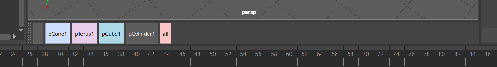

# AD_Selector

Maya 2024 Selector / Picker script based on selection sets

## Features

- **Minimalistic Design**: Clean and efficient user interface
- **Dockable UI**: Fully dockable window that integrates with Maya's interface
- **Smart Selection**:
  - Regular click: Select objects
  - Shift click: Add to current selection
  - Ctrl click: Remove from current selection
- **Btn Management**:
  - Export/Import to file
  - Quick export/import to move btns between Maya windows
  - Customize button colors
  - Reorder buttons

## Installation

Copy the `AD_Selector` folder to your Maya scripts directory
   ```
   C:\Users\UserName\Documents\maya\2024\scripts
   ```
   Note: Replace "UserName" with your Windows username
## Usage

Launch the tool in Maya using the following Python commands:

```python
import AD_Selector.ADSelector as ads
import importlib
importlib.reload(ads)
ads.initialize()
```

## Requirements

- Autodesk Maya 2024
